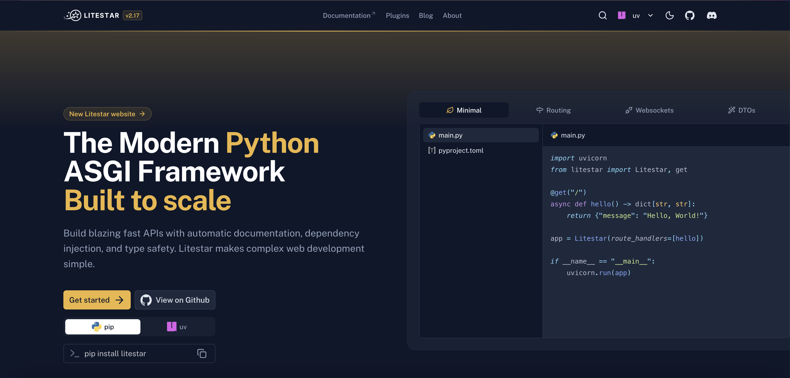

<a href="https://litestar.dev"></a>

# litestar.dev

Welcome to the Litestar website repository available on [litestar.dev](https://litestar.dev).

## Setup

Make sure to enable corepack and install the dependencies:

```bash
corepack enable
pnpm install
```

## Development

Start the development server on `http://localhost:3000`:

```bash
pnpm dev
```

## Add a Litestar Plugin

To add a new Litestar plugin, create a pull request on the [litestar-org/plugins](https://github.com/litestar-org/plugins) repository.

## Deployment

The site is automatically deployed to GitHub Pages via GitHub Actions when changes are pushed to the `main` branch.

```bash
pnpm generate
```

## Testing

TODO

## Inspiration

> [!NOTE]  
> This website was heavily inspired by the [Nuxt website](https://nuxt.com)

## License

[MIT License](./LICENSE)
